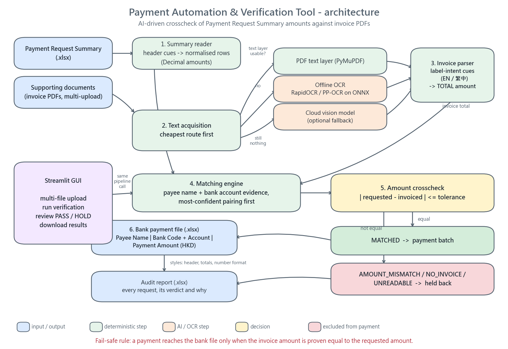

# Payment Automation & Verification Tool

An AI-powered tool that **crosschecks the payment amount in a Payment Request Summary
against the total on its supporting invoice**, and generates a bank payment file
containing only the payments that actually verified.

Invoices are read with **OCR** (PDF text layer where available, local offline OCR for
scans, optional cloud vision as a last resort), so scanned and bilingual invoices work
without any manual data entry.

Built for the MediConCen interview task *Payment Automation & Verification Tool*.

---

## 1. What it does

Upload a Payment Request Summary (Excel) and any number of invoice PDFs through a web GUI.
For every payment request the tool:

1. reads the invoice with **no network and no API key** (RapidOCR / PP-OCR on ONNX Runtime),
2. extracts the invoice **total amount**, tolerating English and traditional-Chinese
   layouts, table captions on a separate row from their values, and OCR noise
   (`BankAccountNumber`, `银行眼户號碼`, `TotalAmount:HKD15,000.00`),
3. crosschecks that amount against the summary's `Payment Amount (HKD)`,
4. includes **only verified** payments in the bank payment file, and
5. explains every held-back payment on screen and in an audit report.

### Verified against the supplied sample data

| Request | Payee | Requested (HKD) | Invoice read | Invoice total | Verdict |
|---|---|---|---|---|---|
| P000001 | ABC Medical Centre Limited | 15,000.00 | P0001.pdf (OCR) | 15,000.00 | **PASS** |
| P000002 | XYZ Office Supplies Limited | 5,800.00 | P0002.pdf (OCR) | 5,800.00 | **PASS** |
| P000003 | Healthy Imaging Centre Limited | 125,000.00 | P0003.pdf (text layer) | 120,000.00 | **HOLD - amount mismatch** |

**Bank payment file** (the required output format):

| Payment Request No | Payee Name | Bank Code and Account Number | Payment Amount (HKD) |
|---|---|---|---|
| P000001 | ABC Medical Centre Limited | 004-123456789 | 15000 |
| P000002 | XYZ Office Supplies Limited | 004-456789123 | 5800 |
| | **TOTAL** | | **20800** |

P000003 is deliberately absent: 125,000.00 was requested against a 120,000.00 invoice.
Payee name, bank code and account number are taken from the **summary** (the file of
record); the amount is the crosschecked figure.

---

## 2. Quick start

```bash
# 1. install
pip install -r requirements.txt

# 2. run the GUI (opens http://localhost:8501)
streamlit run app.py
```

Then, in the browser:

1. Upload `Payment Request Summary_Sample.xlsx` in **1. Payment Request Summary**.
2. Upload `P0001.pdf`, `P0002.pdf`, `P0003.pdf` in **2. Payment supporting documents**
   (multiple files in one go is supported).
3. Press **Verify payments and generate bank file**.
4. Download the bank payment file and the audit report.

The first OCR run loads the recognition models (a few seconds); later runs are fast.

### Command line (same pipeline, useful for the demo)

```bash
pavt "Payment Request Summary_Sample.xlsx" P0001.pdf P0002.pdf P0003.pdf \
     --reference SAMPLE-BATCH --output-dir output
```

```
[PASS] P000001  ABC Medical Centre Limited       requested     15000.00  invoice     15000.00  MATCHED
[PASS] P000002  XYZ Office Supplies Limited      requested      5800.00  invoice      5800.00  MATCHED
[HOLD] P000003  Healthy Imaging Centre Limited   requested    125000.00  invoice    120000.00  AMOUNT_MISMATCH
```

Useful flags:

| Flag | Purpose |
|---|---|
| `--force-ocr` | Ignore PDF text layers and OCR everything (to demo the OCR path) |
| `--tolerance 0.01` | Accepted amount difference in HKD |
| `--no-vision` | Disable the optional cloud-vision OCR fallback |
| `--json` | Machine-readable result, e.g. for a scheduled batch job |

---

## 3. Architecture



The design principle throughout is **fail safe**: a payment reaches the bank file only
when the invoice amount is *proven* equal to the requested amount. Anything ambiguous —
no matching invoice, unreadable amount, difference beyond tolerance — is held back and
explained, never paid.

### Text acquisition is cheapest-route-first

| Route | When | Cost |
|---|---|---|
| PDF text layer (PyMuPDF) | digital invoices (`P0003.pdf`) | instant, exact |
| Offline OCR (RapidOCR/PP-OCR, ONNX) | scans (`P0001.pdf`, `P0002.pdf`) | ~2 s/page, no network |
| Cloud vision model | optional; only if configured and the above failed | slow, needs API key |

A scan is detected by measuring the text layer, not by a truthiness check: the supplied
scans carry only the letterhead (`"ABC Medical Centre Limited"`), which a naive check
would accept as a complete document.

### Project layout

```
app.py                        Streamlit GUI
src/pavt/
  money.py                    Decimal money parsing/formatting (the safety-critical bit)
  models.py                   domain models, MatchStatus
  extraction.py               text layer, OCR engine, reading-order reconstruction
  vision.py                   optional cloud-vision OCR fallback
  invoice_parser.py           template-independent invoice field/total parsing
  summary_reader.py           Payment Request Summary (Excel) reader
  verification.py             pairing + crosscheck engine
  bank_file.py                bank payment file + audit report writers
  pipeline.py                 orchestration + CLI
  bootstrap.py                makes vendored OCR wheels importable
tests/                        135 tests, including the golden sample batch and the GUI
tools/vendor_ocr.py           offline wheel vendoring (sandbox workaround, see section 7)
tools/make_diagram.py         regenerates docs/architecture.png
```

---

## 4. How the OCR and the AI fit together

**OCR.** `RapidOCR` runs the PP-OCR detection + recognition models on **ONNX Runtime**,
entirely on the local machine. The models ship inside the wheel, so recognising an
invoice involves **no network call and no API key** — which also means invoice data never
leaves the machine. Both English and traditional Chinese are handled by the same model.

**OCR misreads are repaired before amounts are parsed.** The newer PP-OCRv4 model reads
the samples cleanly, but the older v3 model — which is what a Python 3.13 `pip install`
resolves to, because `rapidocr-onnxruntime` declares `Requires-Python <3.13` — reads
`15,000.00` as `15,ooo.o0` and `5,800.00` as `5,8oo.oo`. Taken literally that reports
**15.00**, i.e. a wrong payment rather than a held one. `normalise_ocr_numbers` therefore
repairs two well-understood misreads *inside numeric tokens only*, before the amount
scanner runs:

| OCR output | Repaired | Note |
|---|---|---|
| `15,ooo.o0` | `15,000.00` | letter O read where a zero belongs |
| `5,8oo.oo` | `5,800.00` | same, for the cents too |
| `15.000.00` | `15,000.00` | period used where a thousands separator belongs |
| `ABCO123` | unchanged | a letter in an identifier stays a letter |

The tool is verified against **both** model generations: the full test suite passes with
RapidOCR 1.4.4 (PP-OCRv4) and with 1.2.3 (PP-OCRv3).

**Reading order matters more than raw accuracy.** OCR returns text boxes in arbitrary
order, and a `y // constant` sort looks plausible but splits a label from its value when
they sit a few pixels apart — exactly the case that matters for `Bank Code` / `004`. The
engine instead clusters boxes into rows by vertical overlap, then orders each row
left-to-right and joins close boxes with a space, distant ones with a column break. That
reconstruction is what lets the parser see `Bank Code  004` as one row.

**The optional AI layer.** A vision-capable LLM reads unfamiliar layouts — rotated scans,
stamps, unusual languages — far more robustly than a fixed OCR pipeline.
`src/pavt/vision.py` supports OpenAI and Anthropic vision models and is used **only** as a
fallback when local extraction produced nothing, or when `PAVT_OCR_MODE=vision` asks for
it. It is disabled by default and the tool is fully functional offline:

```bash
export OPENAI_API_KEY=...        # enables the fallback (optional)
export PAVT_VISION_MODEL=gpt-4o-mini
```

**Parsing is intent-based, not template-based.** Twelve supplier layouts would otherwise
need twelve regexes. Each field declares cues (`payee name` / `收款人`, `銀行編號` / `银行编號`,
`總計` / `Total` / `Amount Due`), and the value is taken from the same table cell as the
cue, from a caption row's matching data column, or from the following line — with shape
validators (`bank code` must be 3 digits, a date must look like a date) so a caption is
never mistaken for a value.

**Money is never a float.** Amounts are `Decimal` end to end, rounded half-up to cents the
way an accountant expects, and compared with an explicit tolerance. Parsing is deliberately
conservative: a figure only counts as money when the document marks it as money — it has a
decimal point, a thousands separator, or a currency symbol. That one rule is why
`140981024` (invoice no.), `987654321` (bank account) and `2026/09/08` (date) are never
mistaken for amounts, and why `1.23456` does not silently become `1.23`.

---

## 5. Matching invoices to payment requests

Amount agreement alone is **not** sufficient to pair a request with an invoice — two
different suppliers can bill the same round figure, and pairing on amount would then
report a misleading "amount mismatch" instead of the truth (no invoice supplied). Pairing
therefore works in tiers, most-confident first, and each decision is recorded with its
reason and confidence:

1. **Payee name similarity** (normalised for case, punctuation, `Limited`/`Ltd`), boosted
   by a matching bank code/account and by an agreeing amount.
2. **Bank code + account number** when the payee name was garbled by OCR.
3. **Unique matching amount** — only when the payee name is *unreadable*, so it cannot
   override a readable name that simply did not match.
4. Otherwise the request is reported as `NO_INVOICE`.

Verdicts:

| Status | Meaning | In bank file? |
|---|---|---|
| `MATCHED` | invoice total equals the requested amount within tolerance | yes |
| `AMOUNT_MISMATCH` | an invoice was matched but the totals differ | no |
| `NO_INVOICE` | no supporting document could be matched | no |
| `UNREADABLE` | a document was matched but its amount could not be extracted | no |

---

## 6. Tests

```bash
pytest            # 135 tests
```

| File | Covers |
|---|---|
| `test_money.py` | amount parsing/rejection, `Decimal` precision, tolerance, name folding, **OCR misread repair** |
| `test_invoice_parser.py` | OCR reading-order reconstruction, EN/繁中 layouts, caption-vs-value |
| `test_summary_reader.py` | header aliases, Chinese captions, leading-zero bank codes, malformed rows |
| `test_verification.py` | pairing tiers, the four verdicts, tolerance, fail-safe behaviour |
| `test_bank_file.py` | required columns, only-verified inclusion, totals, audit report |
| `test_pipeline_end_to_end.py` | **the golden sample batch**: 2 pass, P000003 held back |
| `test_app_gui.py` | the GUI itself, driven through Streamlit's `AppTest` harness |

Several tests are regressions for real bugs found during development — for example that a
clearly different payee with a coincidentally equal amount must not be paired, and that a
readable caption must never become a field value.

---

## 7. Note on the development sandbox (and `.pylibs`)

The environment this project was developed in applies a **Deny** ACE
(`Everyone: DeleteSubdirectoriesAndFiles`) to the workspace root. That blocks *deletes*,
so `pip install` fails while removing its temporary `*.whl.metadata`:

```
ERROR: Could not install packages due to an OSError: [Errno 13] Permission denied:
  ...\pip-unpack-xxxx\rapidocr_onnxruntime-...whl.metadata
```

`tools/vendor_ocr.py` works around it using only the standard library — it queries the
PyPI JSON API, downloads wheels and unzips them into `.pylibs/` without ever deleting
anything. `pavt.bootstrap` then puts that directory on `sys.path`, so the rest of the
code, the GUI and the tests use plain `import rapidocr_onnxruntime`.

**On a normal machine this is unnecessary**: `pip install -r requirements.txt` installs
RapidOCR into site-packages and `.pylibs/` is ignored (and git-ignored). To use the
vendored route instead:

```bash
python tools/vendor_ocr.py rapidocr-onnxruntime
```

---

## 8. Design decisions worth calling out

- **Fail safe, not best effort.** Given a choice the tool holds a payment back rather
  than paying one it cannot prove. A false hold costs one manual check; a false pass costs
  money.
- **Amount only, matching the brief.** The task states only the `Payment Amount` needs
  validation, so payee name and bank details are *used* as matching evidence but never
  themselves treated as a verification failure.
- **Summary is authoritative for payee/bank details.** Details in the bank file follow the
  summary even if the invoice disagrees, per the generated-file specification.
- **`Decimal`, never `float`**, plus an explicit, configurable tolerance (default 0.01).
- **Everything is auditable.** Each verdict carries its status, the read route
  (text layer / OCR / vision), a match confidence and a plain-language reason, exported to
  an Excel audit report. An operator can always answer "why was this held back?".
- **GUI is a thin shell.** `app.py` calls the same `pavt.pipeline.run_verification` the CLI
  and the tests use, so the demo path is the tested path.
